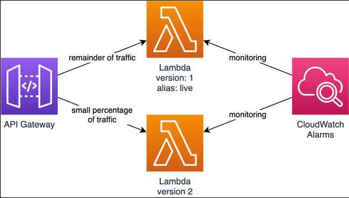
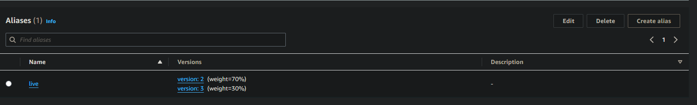
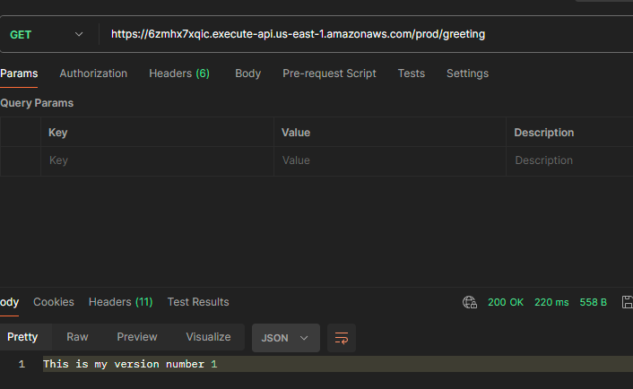
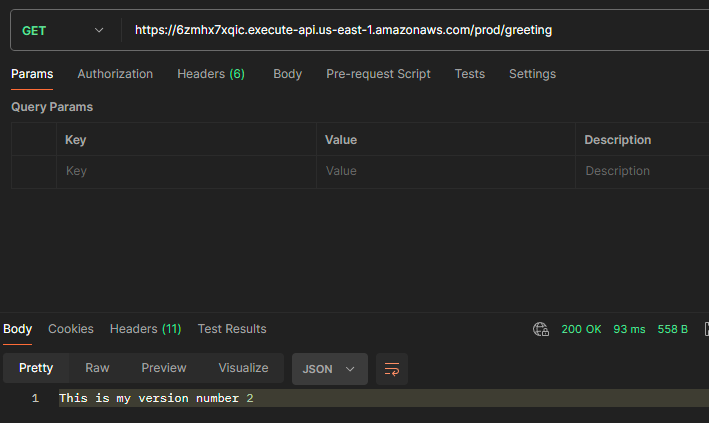

# How to deal with multiple versions and deployments of lambda functions ?

### Problem to resolve

In the world of serverless computing, managing Lambda functions efficiently is crucial. When dealing with multiple versions and deployments, developers employ various strategies to ensure smooth transitions and minimize disruptions as the Automated Deployments and Inmutable Functions, but this isn't enought without a right use of Lambdas Versioning management 

### Lambda Versioning & Alias

**Function Versions and Aliases**: Lambda allows you to create versions of their functions. Each version represents a snapshot of the code and configuration settings. By using aliases, you can point to specific versions, allowing seamless transitions during deployments. For instance, a “ProdV1” alias might always point to the latest stable version, while a "ProdRelease1" alias could be used for testing new features.

### Deployments

**Canary Deployments**: To minimize risks during updates, you may consider canary deployments. Create a new version of your Lambda function and gradually **shift traffic** to it. Monitor performance and gather feedback before rolling out the update to all users. This approach ensures that any issue is caught early and mitigated.



Thoughtful version management, canary deployments, and automation play key roles in handling multiple versions and deployments of Lambda functions. You should choose the approach that best aligns with your application’s requirements and development workflow.

### Test solution

#### Tool Set

* SAM Template with simple AWS Lambda configuration
* Python Hello World Function with its respective Dockerfile
* Previously you must create one ECR Repository where your docker images will be hosted 
* AWS User with credentials allowed to create:
    * Lambdas Functions
    * Iam Roles & Policies
    * Apigateways & Apigateways Stages & Apigateway Deployments
    * Cloudformation Full Access

> [!NOTE]
> You only need access to cloudformation if you want to deploy the functions using the template hosted on this repository

### Deploy our fist function version

For our functions we will use a docker image build based on the Dockerfile of this repository. v1 will be printing the message ```This is my version number 1``` and the other ```This is my version number 2```







