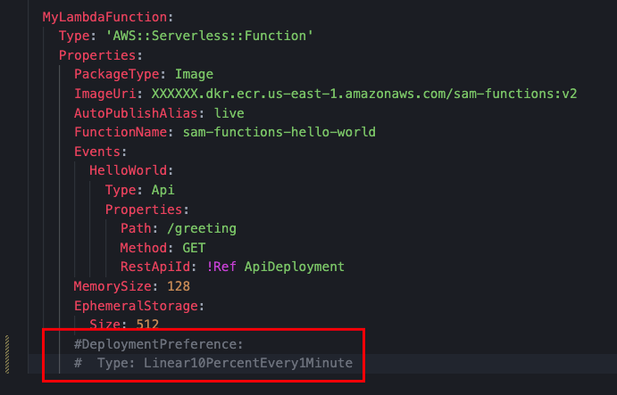

# How to deal with multiple versions and deployments of lambda functions ?

### Problem to resolve

In the world of serverless computing, managing Lambda functions efficiently is crucial. When dealing with multiple versions and deployments, developers employ various strategies to ensure smooth transitions and minimize disruptions as the Automated Deployments and Inmutable Functions, but this isn't enought without a right use of Lambdas Versioning management 

### Lambda Versioning & Alias

**Function Versions and Aliases**: Lambda allows you to create versions of their functions. Each version represents a snapshot of the code and configuration settings. By using aliases, you can point to specific versions, allowing seamless transitions during deployments. For instance, a “**ProdV1**” alias might always point to the latest stable version, while a "**ProdRelease1**" alias could be used for testing new features.

### Deployments

**Canary Deployments**: To minimize risks during updates, you may consider canary deployments. Create a new version of your Lambda function and gradually **shift traffic** to it. Monitor performance and gather feedback before rolling out the update to all users. This approach ensures that any issue is caught early and mitigated.


Thoughtful version management, canary deployments, and automation play key roles in handling multiple versions and deployments of Lambda functions. You should choose the approach that best aligns with your application’s requirements and development workflow.

### Test solution

#### Tool Set

* SAM Template with simple AWS Lambda configuration
* Python Hello World Function with its respective Dockerfile
* Previously you must create one ECR Repository where your docker images will be hosted 
* AWS User with credentials allowed to create:
    * Lambdas Functions
    * Iam Roles & Policies
    * Apigateways & Apigateways Stages & Apigateway Deployments
    * Cloudformation Full Access

> [!NOTE]
> You only need access to cloudformation if you want to deploy the functions using the template hosted on this repository

### Types of Deployments in AWS Lambdas

In AWS Lambdas you can choose the deployment preference type, you can select between Canary and Linear deployments, each one with different traffic shift measure

* **Canary**: Traffic is shifted in two increments, this increments are represented in the percentage of traffic that will be shifted to the new version, and the interval in minutes before the remaining traffic is shifted in the second increment

* **Linear**: Traffic is shifted in equal increments with an equal number of minutes between each increment

| Deployment Preference Type   |
|------------------------------|
| Canary10Percent30Minutes     |
| Canary10Percent5Minutes      |
| Canary10Percent10Minutes     | 
| Canary10Percent15Minutes     | 
| Linear10PercentEvery10Minutes| 
| Linear10PercentEvery1Minutes | 
| Linear10PercentEvery2Minutes | 

### Deploy our first function version

For our functions we will use a docker image build based on the Dockerfile of this repository. v1 will be printing the message ```This is my version number 1``` and the other ```This is my version number 2```

This test will be deployed with **Linear10PercentEvery1Minute** which reffers to shift traffic in equal increments every 1 Minute

> [!NOTE]
> If you want to deploy the function with the SAM Template hosted in this repository you will need to comment two lines in the deployment of the first function to see how works the deployment before using the Linear or canary preference and after. 

>* Remember use de command ```sam deploy --guided``` to execute the deployments using SAM

In this stage you can test you Lambda Function with the Http Apigateway endpoint created

### Deploy lambda with new version with Linear deployment

To the second deployment, we need to discomment the two lines that reffer to the Deployment preference

> [!NOTE]
> Also Remember to change the image version in the template.yaml

After completing the second deployment you can go to the Lambda Dashboard in the tab that reffers to the Aliases and you will see how traffic is being shifted into the new version, and every minute will shift an equal part of traffic to this version if no errors occur


### Test your application

In this part you can test the Http endpoint and after multiple requests you may see the response of each version pointing to the same path and the same apigateway

#### Test Version 1


### Test Version 2


### Next Steps

* Implement CloudWatch alarms to exec rollback if the new version is givin errors on your custom or predefined metrics
* Implement Hooks in Lambda that validate if the functions are run before and after traffic shifting

> [!WARNING]
> Remember to delete your cloud resources if you don't need it to avoid additional costs using **``` sam delete ```**