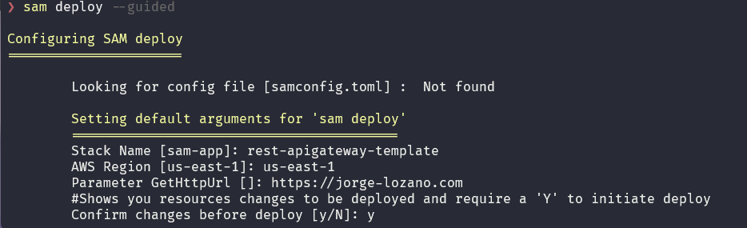
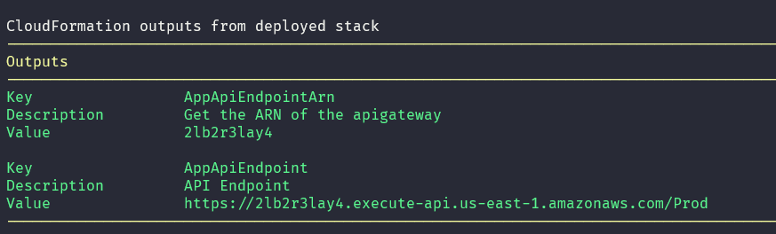
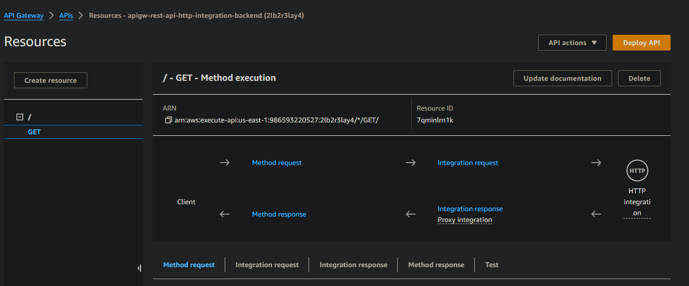

# Rest Apigateway

*With this template you can deploy an Amazon API Gateway REST API endpoint with a simple public HTTP endpoint integration.*

### Requirements
* *AWS Sam CLI*  - [Install Documentation](https://docs.aws.amazon.com/serverless-application-model/latest/developerguide/install-sam-cli.html)

### Validate SAML Template
* In the console you can verify if the template is linted and valid **``` sam validate --lint ```** to avoid any lint error or missing configuration in your template

### Build and Deploy SAML Template

* Clone this repository or copy this template, then execute **``` sam build ```** in the terminal

This command creates the artifacts and the template that will be deployed

### Deploy SAML Template

* Deploying this template with **``` sam deploy ```**  or with **```sam deploy --guided```** will create a Rest Apigateway with a method GET configured with custom URL as a parameter

> [!NOTE]
> If you use the --guided you will see something like this, and must provide some information to get a successfully deployment



* During deployment you will get the output of the resources that will be created in your stack

### Test your resources
When the deployment gets finished you will see in console your defined outputs and you can go to the AWS Console to verify and test your resources





> [!WARNING]
> Remember to delete your cloud resources if you don't need it to avoid additional costs using **``` sam delete ```**
